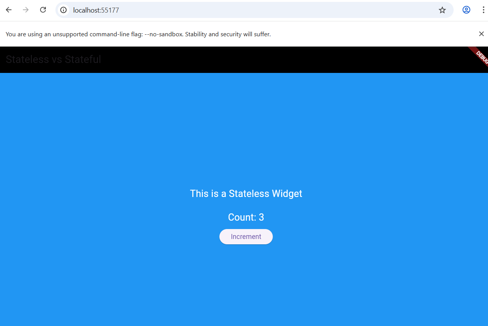

# ***Experiment 5: Stateful & Stateless Widgets and State Management***

## **Aim**
a) To understand and differentiate between **Stateful** and **Stateless** widgets in Flutter.  
b) To implement basic state management using **setState()** and **Provider**.

---

## **Procedure**

1. Created a new Flutter project using:  
   ```flutter create experiment5_state_management```
2. Opened the project in **VS Code**.
3. Inside the `lib` folder, created separate Dart files:
   - `main.dart`
   - `stateless_example.dart`
   - `stateful_example.dart`
   - `provider_example.dart`
4. Studied:
   - **StatelessWidget** → UI that does not change.
   - **StatefulWidget** → UI that updates when internal state changes.
5. Implemented state updates using:
   - **setState()** inside a Stateful widget.
6. Added **Provider** package in `pubspec.yaml`:
   ```yaml
   dependencies:
     provider: ^6.1.2

### Output

[](output5.png)