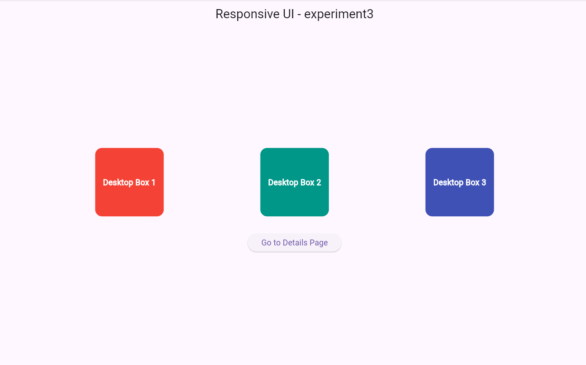

# ***Experiment 3: Responsive UI in Flutter***

## **Aim**
To design a responsive user interface (UI) in Flutter that adapts to different screen sizes using **MediaQuery** and layout breakpoints.

## **Procedure**
1. Created a new Flutter project using the command:  
   ```flutter create b_responsive_ui```
2. Opened the project in **VS Code**.
3. Navigated to the `lib` folder and modified **main.dart** to include responsive UI code.
4. Used **MediaQuery** to read screen width and height.
5. Implemented **breakpoints** to adjust UI layout for:
   - Small screens (mobile)
   - Medium screens (tablets)
   - Large screens (desktop)
6. Ran the app using:
   - **Run → Start Debugging**, or  
   - Command: ```flutter run```

### Output

[](mqoutput.png)
