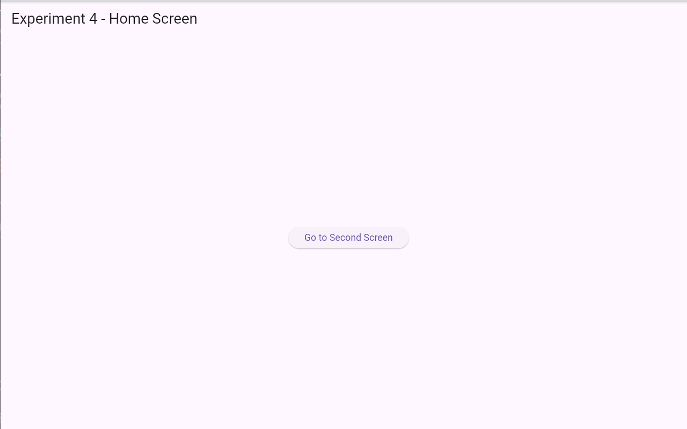

# ***Experiment 4: Navigation in Flutter***

## **Aim**
a) To set up navigation between different screens using the **Navigator** class.  
b) To implement navigation using **named routes** in Flutter.

## **Procedure**
1. Created a new Flutter project using the command:  
   ```flutter create experiment4_navigation```
2. Opened the project in **VS Code**.
3. Inside the `lib` folder, created multiple Dart files such as:
   - `main.dart`
   - `home_screen.dart`
   - `second_screen.dart`
4. Implemented navigation using:
   - **Navigator.push()** and **Navigator.pop()**
   - **Navigator.pushNamed()** with defined route names
5. Defined named routes inside `MaterialApp` using the `routes:` property.
6. Tested navigation by clicking buttons to move between screens.
7. Ran the app using:  
   ```flutter run```

### Output
[](nvg.png)
