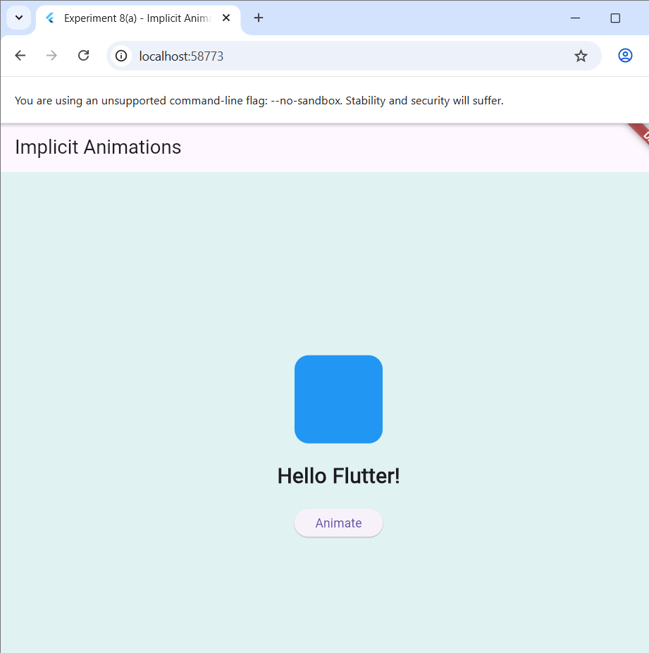

# ***Experiment 8: Forms, Input Fields & Validation in Flutter***

## **Aim**
a) To design a form with various input fields in Flutter.  
b) To implement form validation, error handling, and input checks.

---

## **Procedure**

1. Created a new Flutter project using:  
   ```flutter create experiment8_forms```

2. Opened the project in **VS Code**.

3. Inside the `lib` folder, created and edited:
   - `main.dart`
   - `form_screen.dart`

4. Learned how to implement a **Form widget** using:
   ```dart
   final _formKey = GlobalKey<FormState>();

### Output

[](Output8.png)
