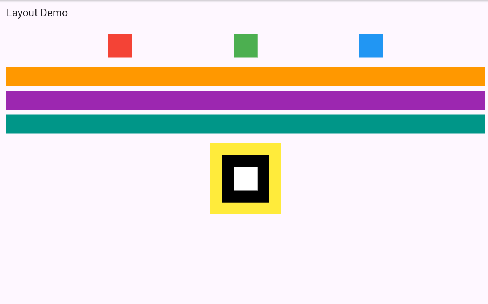

# ***Experiment 2(a): Explore Flutter Widgets***

## **Aim**
To explore and understand basic Flutter widgets such as **Text**, **Image**, and **Container**, and learn how they are used to build UI elements in a Flutter application.

## **Procedure**
1. Created a new Flutter project using the command:  
   ```flutter create a_widgets```
2. Opened the project in **VS Code**.
3. Navigated to the `lib` folder and opened **main.dart**.
4. Replaced the existing code with the required Flutter widget examples.
5. Ran the app using:
   - **Run → Start Debugging**, or  
   - The command: ```flutter run```

## **Program**
```dart
// See main.dart file for complete code.

### Output 

[](widgets_output.png)